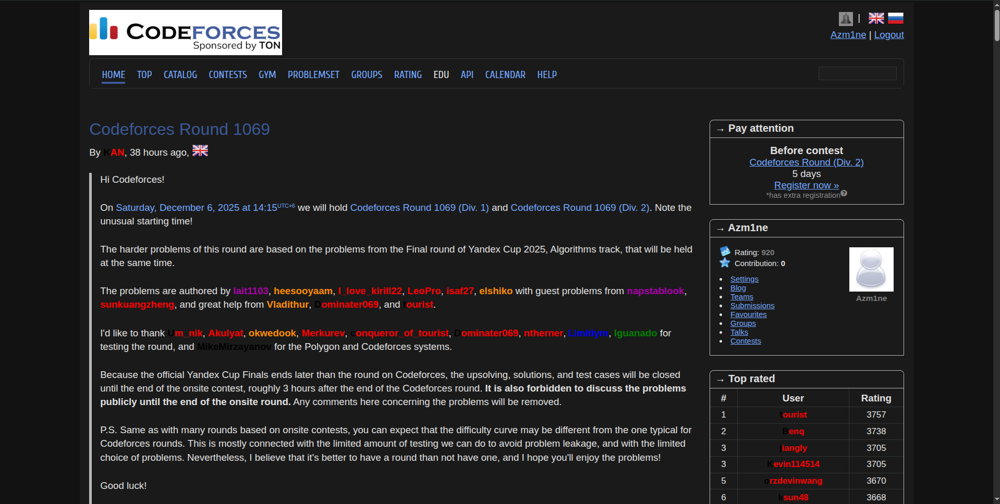
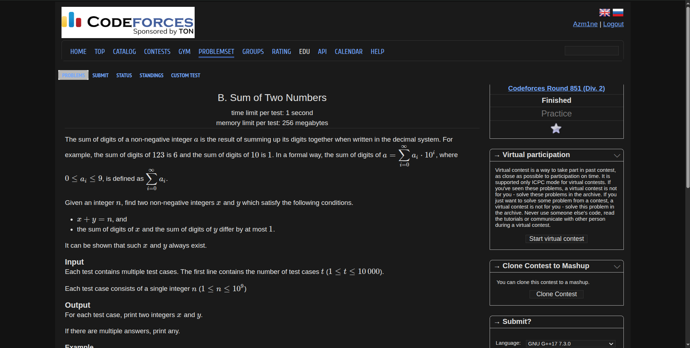
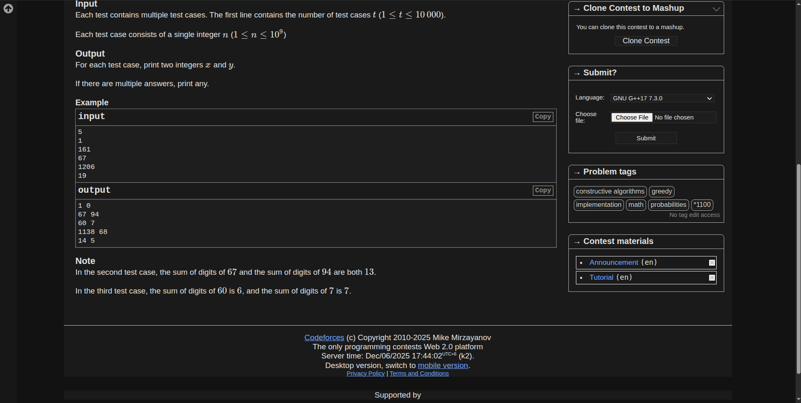
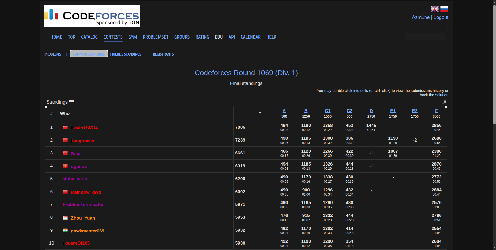

# Codeforces Dark Mode

A lightweight browser extension that applies a dark theme to Codeforces.
No scripts, no network access, no performance hit — one CSS file injected as a
content script.

## ✨ Features

- Full-site dark mode for Codeforces
- Rank colours reworked for dark backgrounds — every handle clears WCAG AA
  contrast, including admin/legendary handles that Codeforces renders in black
- Readable blog headings, quotes and rendered MathJax
- Dark syntax highlighting for submitted source code and `prettyprint` blocks
- Dark Ace editor on the submit pages, with syntax colours to match
- Styled tables, problem statements, blogs, comments, forms and menus
- Works on the `m1`/`m2`/`m3` mirrors as well as the main site
- CSS only — nothing runs on the page

### Known limitations

The rating graph and the activity heatmap are drawn by Codeforces into a
`<canvas>`/`<svg>` with colours baked in, so they keep their light palette.
CSS can make them visible on a dark page but cannot recolour them.

## 🚀 Install

The extension is not on any store, so it is loaded unpacked from this folder.

### Chrome / Edge / Brave

1. Clone or download this repository.
2. Open `chrome://extensions` (Edge: `edge://extensions`).
3. Turn on **Developer mode** (top-right toggle).
4. Click **Load unpacked** and select the folder containing `manifest.json`.
5. Open <https://codeforces.com> — the theme applies immediately.

The extension stays loaded across restarts. To update, `git pull` and press
**Reload** (↻) on the extension's card.

### Firefox

Firefox drops temporary add-ons when it closes, so this is per-session:

1. Open `about:debugging#/runtime/this-firefox`.
2. Click **Load Temporary Add-on…**.
3. Select the `manifest.json` file in this folder.
4. Open <https://codeforces.com>.

For a permanent install, the add-on has to be signed through
[addons.mozilla.org](https://addons.mozilla.org/developers/).

### Requirements

Chrome 99+, Firefox 97+ or Safari 15.4+ — the stylesheet relies on CSS cascade
layers (see below).

## 🔧 How it works

A content script's stylesheet is injected *before* the page's own stylesheets.
When Codeforces and this file declare the same property with `!important` at the
same specificity, Codeforces wins the tie on source order — which is why an
override like `.user-blue { color: … !important }` had no effect and blue
handles stayed at 1.3:1 contrast against the dark background.

For `!important` declarations the cascade *reverses* layer order, and unlayered
styles rank last. So the whole stylesheet lives in `@layer cf-dark`, which puts
every important rule here above any unlayered page rule regardless of
specificity. The trade-off: every declaration in `dark.css` must carry
`!important` for that to hold.

## ✅ Tests

```sh
python3 tools/check-contrast.py
```

Asserts that every text colour in `dark.css` clears WCAG AA (4.5:1) against
`--bg-tertiary`, the lightest of the three theme surfaces. Clearing the
lightest surface clears the other two.

## 📸 Screenshots

### Home Page


### Problem Page



### Standings

